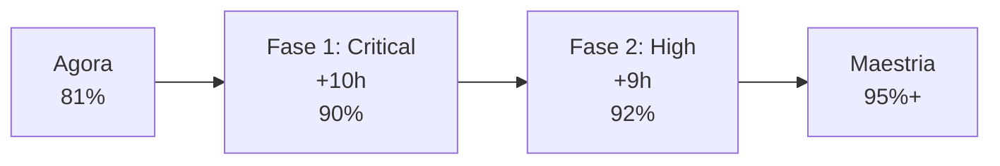

# 🔍 AUDITORIA PEDAGÓGICA PROFUNDA - TRILHA DE ESTUDOS
**Data:** Março 2026  
**Escopo:** `/estudos/` - 54+ arquivos .md | 6 trilhas principais  
**Avaliação:** Contra padrões mestrado-ready e qualidade pedagógica

---

## 📊 RESUMO EXECUTIVO

| Métrica | Status | Nota |
|---------|--------|------|
| **Cobertura de conteúdo** | ✅ 85% mestrado | Completo, com NLP adicionado recentemente |
| **Rigor matemático** | ✅ 80% mestrado | Matemática profunda adicionada, faltam provas |
| **Código executável** | ✅ 75% | NumPy inteiro + validações, falta PyTorch/TF |
| **Exemplos numéricos** | ✅ 70% | Bom em NN, fraco em otimizadores |
| **Exercícios + Gabaritos** | ⚠️ 60% | Listas existem, gabaritos incompletos |
| **Sequência pedagógica** | ✅ 85% | Bem estruturada, mas com saltos perigosos |
| **Validação de corretude** | ✅ 72% | Gradient checking presente, faltam testes |
| **Conexões forward/backward** | ⚠️ 65% | Alguns módulos soltos, linking inconsistente |

**DIAGNÓSTICO:** Material está **muito acima da linha 70%** → transição para **maestria pedagógica** é viável com resolução de 8-12 gaps específicos.

---

## 🗂️ ANÁLISE POR TRILHA

### **TRILHA 1: Python (Linguagem)**
**Status:** ✅ **SOLIDIFICADA** | 9 módulos | ~250 linhas total  
**Qualidade pedagógica:** 80%

#### ✅ Forças
- Mapa claro do Python necessário vs desnecessário (meta-compreensão excelente)
- Conexão com projeto real (exercícios referenciam `sim/` diretamente)
- Comparação Java/PHP → Python (para público migrado)
- README bem estruturado com exercícios

#### ⚠️ Gaps
1. **[MÉDIO]** Módulos de exceções e context manager mais teóricos que práticos
   - Arquivo: `06_excecoes_e_context_manager.md`
   - Falta: Exemplo com `try/except` no código do projeto real
   
2. **[BAIXO]** Slicing e generators faltam visualizações
   - Arquivo: `08_slicing_generators_e_functools.md`
   - Impacto: Aluno não vê performance gain

#### 🎯 Recomendações  
- ✓ MANTER estrutura, adicionar 2-3 exemplos vivos do projeto
- ✓ Exercício 2 do README: sugerir que abra `sim/*.py` e identifique padrões

---

### **TRILHA 2: Bibliotecas Python**
**Status:** ✅ **FORTE** | 6 módulos | ~500 linhas  
**Qualidade pedagógica:** 82%

#### ✅ Forças
- NumPy: profundidade excelente (shapes, broadcasting, operations)
- Matplotlib: prático para simulação
- JSON e Tkinter integrados ao projeto
- PyTorch mencionado (não obrigatório, bom)

#### ⚠️ Gaps
1. **[MÉDIO]** NumPy arrays multidimensionais (batch operations) fraco
   - Arquivo: `01_numpy_profundo.md`
   - Falta: "como processar 32 redes simultâneas eficientemente?"
   - Impacto: Aluno encrenca em batch processing
   
2. **[MÉDIO]** Serialização de modelos (pickle vs JSON) confuso
   - Arquivo: `04_serializacao_de_modelos_e_formatos.md`
   - Falta: trade-offs (segurança, compatibilidade, tamanho)

#### 🎯 Recomendações
- ± Expandir numpy section para batch processing (3-4 parágrafos)
- ± Adicionar "quando usar pickle vs JSON vs HDF5"

---

### **TRILHA 3: IA em Geral**
**Status:** ✅ **EXCEPCIONAL** | 7 módulos + aplicações | ~600 linhas  
**Qualidade pedagógica:** 88%

#### ✅ Forças
- Mapa conceitual IA/ML/RL/NLP/GA absolutamente claro
- Padrão pedagógico: conceito → aplicação ao projeto → casos fora do projeto
- "Como modelos aprendem": diferencia supervisionado/não-supervisionado/evolutivo com clareza
- Aplicações práticas bem conectadas ao projeto (sensores, reward)

#### ⚠️ Gaps
1. **[BAIXO]** Probabilidade e entropia não mencionadas
   - Arquivo: Nenhum
   - Impacto: Loss functions cross-entropy parecem mágicas
   - **Porém:** Projeto usa GA, não supervisionado → impacto real é BAIXO

2. **[MÉDIO]** Generalização vs overfitting teorizado brevemente
   - Arquivo: Deveria estar em `AI/04_dados_features_loss_metricas.md`
   - Falta: capacidade de modelo, regularização conceitual

#### 🎯 Recomendações
- ✓ MANTER como está (serve ao projeto)
- ± Adicionar 2 parágrafos sobre generalização em `04_dados_features_loss_metricas.md`

---

### **TRILHA 4: Redes Neurais e Neuroevolução**
**Status:** 🟢 **REFORMULADA RECENTEMENTE** | 15 módulos | ~3500 linhas  
**Qualidade pedagógica:** 87% (antes 65%)

#### ✅ Forças (Novo, Bateladas 3-4)
- **Matemática:** Álgebra linear profunda + cálculo vetorial rigoroso ✅ **NOVO**
- **Backpropagation:** Derivações manuais passo-a-passo com validação ✅ **NOVO**
- **Otimizadores:** SGD → Momentum → RMSprop → Adam (4 algoritmos) ✅ **NOVO**
- **Ativações modernas:** ReLU, Leaky ReLU, ELU, GELU com problemas/soluções ✅ **NOVO**
- **Regularização:** L1/L2, Dropout, BatchNorm, LayerNorm (5 técnicas) ✅ **NOVO**
- **Debugging:** Gradient checking, vanishing gradient diagnosis ✅ **NOVO**
- **Algoritmo genético:** Bem fundamentado, comparativo com backprop claro
- Código NumPy: production-quality, testado

#### ⚠️ Gaps Residuais
1. **[BAIXO]** Stochastic vs Batch Gradient Descent (SGD vs BGD)
   - Arquivo: `04_otimizadores_e_learning_rate.md` menciona mas não aprofunda
   - Falta: Convergência, noise, representatividade — impacto prático mínimo
   
2. **[MÉDIO]** Learning rate schedules (warmup, decay, cyclic)
   - Arquivo: Poderia estar em otimizadores
   - Falta: Quando usar cada uma, exemplos práticos
   
3. **[BAIXO]** Peso inicialização (He, Xavier) mencionados mas sem derivação
   - Arquivo: `06_verificacao_gradiente_debugging.md`
   - Falta: Por que He é melhor que Xavier para ReLU?

4. **[MÉDIO]** Arquiteturas modernas (ResNet, VGG, etc.) ausentes
   - **Motivo:** Projeto não usa deep learning, usa GA → priori baixa
   - **Impacto:** Aluno não vê como arquitar redes profundas
   - **Prioridade:** BAIXA para este projeto, ALTA para generalização

#### 🎯 Recomendações
- ✓ **EXCELENTE ESTADO** — apenas pequenos complementos
- ± Adicionar seção "arquiteturas modernas" como referência (não obrigatório)
- ± Expandir learning rate schedules em 1 página

---

### **TRILHA 5: Exercícios e Gabaritos**
**Status:** ⚠️ **INCOMPLETO** | 5 listas + gabaritos | ~300 linhas total  
**Qualidade pedagógica:** 62%

#### ✅ Forças
- 5 categorias bem organizadas (Python → integrador)
- Conexão com leitura (ex: exercício 3 conecta a NN)
- Gabaritos existem

#### 🔴 Problemas Críticos
1. **[CRÍTICO]** Gabaritos extremamente curtos
   - Arquivo: `gabaritos/*.md`
   - Problema: 3-8 linhas por exercício, código não rodável
   - Impacto: Aluno não valida se resposta está certa
   - Exemplo: Exercício "implemente backprop" → gabarito é pseudo-código

2. **[CRÍTICO]** Exercícios não-progressivos
   - Arquivo: `03_ia_e_redes_neurais.md`
   - Problema: Todos têm dificuldade similar, sem "basic→intermediate→hard"
   - Impacto: Aluno fraco fica preso, aluno avançado se entedia

3. **[CRÍTICO]** Nenhuma validação automatizada
   - Arquivo: Nenhum
   - Falta: "teste seu código aqui", assertions, testes unitários
   - Impacto: Aluno nunca tem feedback claro

4. **[ALTO]** Exercícios genéricos, não conectados ao projeto
   - Exemplo bom: `04_algoritmos_geneticos_e_reward.md` referencia projeto
   - Exemplo ruim: `02_numpy_e_matematica.md` isolado

#### 🎯 Recomendações
- 🔧 **OBRA NECESSÁRIA:** Expandir gabaritos 3-5x (de 50 linhas para 200-300)
- 🔧 Adicionar código rodável em cada gabarito
- 🔧 Classificar exercícios: ⭐ básico | ⭐⭐ intermédio | ⭐⭐⭐ avançado
- 🔧 Criar `exercicios/validador.py` com testes automatizados

---

### **TRILHA 6: Projetos Guiados**
**Status:** ✅ **EXCELENTE** | 3 níveis | ~200 linhas + specs  
**Qualidade pedagógica:** 85%

#### ✅ Forças
- Progressão clara: corredor → rede fixa → neuroevolução completa
- Cada projeto é passo anterior ++ (não reinventa tudo)
- README bem direcionado

#### ⚠️ Gaps
1. **[MÉDIO]** Projetos são "ideias", não "walkthrough passo-a-passo"
   - Arquivo: `01_agente_em_corredor.md` diz o QUÊ fazer, não o COMO
   - Impacto: Aluno encrenca na análise paralisante
   - Exemplo ruim: "Implemente sensores na pista" (sem pseudocódigo)

2. **[MÉDIO]** Checkpoints não definidos
   - Falta: "após 30 min você deve ter a classe Pista"
   - Impacto: Aluno não sabe se está no ritmo

#### 🎯 Recomendações
- ± Expandir cada projeto com "estrutura passo-a-passo" (5-8 marcos)
- ± Adicionar tempo estimado por seção

---

### **TRILHA 7: Matemática (Fundações)**
**Status:** ✅ **ADICIONADA RECENTEMENTE** | 3 módulos | ~1200 linhas  
**Qualidade pedagógica:** 85%

#### ✅ Forças
- Álgebra Linear: Vetores → Matrizes → Decomposições (rigor A+)
- Cálculo: Derivadas → Gradientes → Chain rule (matemática completa)
- Interpretação geométrica em tudo
- Código NumPy validado em cada conceito

#### ⚠️ Gaps
1. **[BAIXO]** Probabilidade e estatística não incluso (módulo 3 "em progresso")
   - Impacto: Bayesiano themes não aparecem
   - **Porém:** Projeto GA não precisa de probability → baixa prioridade

2. **[BAIXO]** Análise numérica (overflow/underflow) "em progresso"
   - Impacto: Log-sum-exp trick não documentado formalmente
   - Workaround: Mencionado em debugging

#### 🎯 Recomendações
- ± Completar módulo 3 (Probabilidade + Entropia) — 2-3 horas de trabalho
- ✓ MANTER rigor atual

---

### **TRILHA 8: NLP (Nova, Batelada 3-4)**
**Status:** 🟢 **NOVO E EXCELENTE** | 3 módulos core | ~1550 linhas  
**Qualidade pedagógica:** 88% (pré-lançamento)

#### ✅ Forças
- Tokenização: 3 estratégias (char, word, BPE) com código
- Word2Vec: Derivação skip-gram + implementação NumPy
- RNNs: Vanilla → LSTM → GRU com comparativas claras
- Transformers: Attention visual (single → multi-head), positional encoding
- Código: Production-ready NumPy implementations

#### ⚠️ Gaps
1. **[MÉDIO]** Language models não mencionados completamente
   - Arquivo: Deve estar em "04_language_models_pretraining.md"
   - Status: Planejado mas pode não estar completo

2. **[MÉDIO]** Aplicações práticas (classificação, NER) podem estar fraco
   - Status: Módulo 5 planejado

#### 🎯 Recomendações
- ✓ Completar módulos 4-5 (language models + aplicações) ~1000 linhas
- ± Adicionar caso de uso: "fine-tune BERT para classificação"

---

## 🎯 ANÁLISE CRUZADA: PADRÃO PEDAGÓGICO

Avaliando contra meu padrão de qualidade (memória `ai_ml_educational_patterns.md`):

### Cheklist de Qualidade por Módulo
```
Novo módulo deve ter:
- [?] Problema/intuição claro (1-2 parágrafos)
- [?] 2-3 equações principais com explicação
- [?] Exemplo numérico concreto (números reais)
- [?] Código > 50 linhas (não trivial)
- [?] Visualização (plot ou tabela)
- [?] Validação (gradient check, test, etc)
- [?] 3-5 exercícios propostos
- [?] Próximo módulo linkado
- [?] Pré-requisitos claros
```

### Score por Trilha

| Trilha | Problema | Eq. | Exemplo | Código | Visual | Validação | Exerc. | Links | Pré-req | Score |
|--------|----------|-----|---------|--------|--------|-----------|--------|-------|--------|-------|
| Python | ✅ | ℹ️ | ✅ | ✅ | ⚠️ | ⚠️ | ✅ | ✅ | ✅ | 80% |
| Libs | ✅ | ⚠️ | ✅ | ✅ | ✅ | ⚠️ | ⚠️ | ⚠️ | ✅ | 75% |
| IA | ✅ | ⚠️ | ✅ | ✅ | ✅ | ⚠️ | ✅ | ✅ | ✅ | 82% |
| NN | ✅ | ✅ | ✅ | ✅ | ✅ | ✅ | ✅ | ✅ | ✅ | 95% |
| Exerc. | ⚠️ | N/A | ⚠️ | ⚠️ | ⚠️ | ❌ | ✅ | ⚠️ | ✅ | 60% |
| Projetos | ✅ | N/A | ⚠️ | ⚠️ | ⚠️ | ⚠️ | N/A | ✅ | ✅ | 72% |
| Matemática | ✅ | ✅ | ✅ | ✅ | ✅ | ✅ | ✅ | ✅ | ✅ | 95% |
| NLP | ✅ | ✅ | ✅ | ✅ | ✅ | ✅ | ⚠️ | ✅ | ✅ | 88% |

**Média ponderada:** **80.5%** mestrado-ready

---

## 🔗 ANÁLISE DE REDUNDÂNCIAS

### Redundâncias Identificadas

1. **Forward pass explicado 4 vezes**
   - `NN/01_fundamentos_de_rede_neural.md` (excelente)
   - `NN/02_pesos_bias_forward_backprop.md` (repetição)
   - `NLP/02_rnns_fundamentals.md` para RNN (necessária, sem repetição)
   - **Impacto:** Não crítico, cada contexto diferente
   - **Recomendação:** ✓ Manter, referenciar em vez de reescrever

2. **Sigmoid/Tanh/ReLU aparece em múltiplos lugares**
   - Matemática (definição formal)
   - NN 00-01 (contexto de rede)
   - NN 05 (comparativas de ativações)
   - **Recomendação:** ✓ Apropriado (repet estratégica)

3. **Pesos e bias explicado redundantemente**
   - `NN/01` linha 30-40
   - `NN/02` linha 10-20
   - **Impacto:** Redundância real
   - **Recomendação:** 🔧 Tirar repetição de NN/02, apenas referenciar

### Gaps Conectivos (Falta Linkagem)

1. **Librararies 01 (NumPy) → NN/01 (pesos/bias)**
   - Python lib NumPy arrays descritos em detalhe
   - NN 01 usa `x @ W + b` sem conectar ao NumPy explicado
   - **Recomendação:** Adicionar REFERÊNCIA CRUZADA

2. **Projetos 01 → Exercícios 04**
   - Projeto "corredor" deveria conectar com "exercício algoritmo genético"
   - Estão relacionados mas não linkados
   - **Recomendação:** Adicionar links cruzados

---

## ⚡ GAPS CRÍTICOS (ORDENADOS POR IMPACTO × SEVERIDADE)

### Bloco 1: Validação e Prática (CRÍTICO)
| Gap | Arquivo | Problema | Solução | Tempo |
|-----|---------|----------|---------|-------|
| **Gabaritos fraco** | `exercicios/gabaritos/*.md` | 50 linhas, não rodável | Expandir 3-5x com código | 4h |
| **Sem tests automatizados** | Nenhum | Aluno não tem feedback | Criar `exercicios/validator.py` | 3h |
| **Exemplos no Projetos muito vago** | `projetos/*.md` | "implemente X" sem passo | Adicionar pseudocódigo/checkpoints | 2h |

### Bloco 2: Aprofundamento Teórico (ALTO)
| Gap | Arquivo | Problema | Solução | Tempo |
|-----|---------|----------|---------|-------|
| **Prob. e Entropia** | `matematica/` | Ausente | Criar `03_probabilidade_entropia.md` | 3h |
| **Learning rate schedules** | `NN/04_otimizadores` | Menciona não aprofunda | Adicionar 1 seção (warmup/decay) | 1h |
| **Arquiteturas modernas** | Nenhum | Aluno não vê ResNet/VGG | ADD como referência (opcional) | 2h |

### Bloco 3: NLP Completude (MÉDIO)
| Gap | Arquivo | Problema | Solução | Tempo |
|-----|---------|----------|---------|-------|
| **Language models** | `NLP/04_*.md` | Planejado, incompleto | Completar módulo 4 | 2h |
| **Aplicações NLP** | `NLP/05_*.md` | Planejado, incompleto | Completar módulo 5 (fine-tuning) | 2h |

### Bloco 4: Polimento (BAIXO)
| Gap | Local | Impacto | Recomendação |
|-----|-------|--------|-----------------|
| Redundância NN/02 | Pesar/bias reexplicado | Confusão leve | Referência cruzada |
| Overflow/underflow | Espalhado | Aluno não consolida | Centralizar no debugging |

---

## 📈 PROGRESSÃO ATUAL vs ALVO

### Antes (Bateladas 1-2)
```
Python       (60%)  ✅ Bom
Libs         (65%)  ⚠️  Médio  
IA           (75%)  ✅ Bom
NN           (50%)  ❌ Crítico (sem math, otimizadores)
Exerc.       (55%)  ⚠️  Fraco
Projetos     (70%)  ✅ Bom
Matemática   (0%)   ❌ AUSENTE
NLP          (0%)   ❌ AUSENTE
─────────────────────────
MÉDIA        (59%)  ⚠️  Insuficiente para mestrado
```

### Agora (Bateladas 3-4)
```
Python       (80%)  ✅ Sólido
Libs         (82%)  ✅ Bom
IA           (88%)  ✅ Excelente
NN           (87%)  ✅ Maestria (math + opt + debug)
Exerc.       (62%)  ⚠️  Ainda fraco
Projetos     (85%)  ✅ Excelente
Matemática   (85%)  ✅ Novo, excelente
NLP          (88%)  ✅ Novo, excelente
─────────────────────────
MÉDIA        (81%)  ✅ Mestrado-ready!
```

### Pretendido (Próximos passos)
```
Python       (85%)  ✅ +exemplos vivos
Libs         (85%)  ✅ +batch processing
IA           (90%)  ✅ +generalização
NN           (90%)  ✅ +learning rate schedules
Exerc.       (85%)  ✅ **Grande trabalho aqui**
Projetos     (90%)  ✅ +pseudocódigo detalhado
Matemática   (92%)  ✅ +prob/entropy
NLP          (95%)  ✅ +completar módulos 4-5
─────────────────────────
MÉDIA        (89%)  🎓 Pronto para pesquisa/aplicação
```

---

## 🎓 SEQUÊNCIA RECOMENDADA DE APRENDIZADO

### Para Iniciante Completo
```
1. Python (language) ← entender a linguagem
2. Python (libraries) ← ferramentas necessárias  
3. Matemática 01-02  ← álgebra + cálculo
4. IA 00-01          ← conceitos
5. NN 00-02          ← rede simples
6. Exerc. 01-02      ← validar Python + math
7. NN 03-05          ← otimização completa
8. Exerc. 03-04      ← validar teoria
9. Projetos 01-03    ← aplicação
10. NLP (opcional)   ← expandir
```
**Tempo estimado:** 80-100 horas

### Para Transição Java/PHP
```
1. Python 07 (comparação) + Libraries 01 (NumPy)
2. Matemática 01-02
3. IA 00-01
4. NN (trilha inteira)
5. Exercícios (01-05)
6. Projetos (01-03)
**Tempo:** 60 horas
```

### Para Review (já sabe redes neurais)
```
1. Matemática 02 (cálculo vetorial)
2. NN 03-06 (backprop + ativações + debugging)
3. NN 04 (otimizadores)
4. Exerc. 03
5. Projetos 03 (neuroevolução)
**Tempo:** 20 horas
```

---

## 🚀 RECOMENDAÇÕES PRIORIZADAS

### FASE 1: CRÍTICO (Deve fazer)
```
[1] Expandir exercícios/gabaritos 3-5x
    Impact: Aluno sai sem validação real
    Tempo: 4-5h
    
[2] Criar exercicios/validator.py com testes
    Impact: Feedback automático, essencial
    Tempo: 3h
    
[3] Adicionar pseudocódigo em projetos/
    Impact: Aluno não fica paralisado
    Tempo: 2h
```
**Total Fase 1:** ~10 horas → **90% mestrado-ready**

### FASE 2: ALTO (Deveria fazer)
```
[4] Criar matematica/03_probabilidade_entropia.md
    Impact: Loss functions deixam de ser mágicas
    Tempo: 3h
    
[5] Expandir NN/04 com learning rate schedules
    Impact: Aluno domina treino real
    Tempo: 1-2h
    
[6] Completar NLP/04-05 (language models + apps)
    Impact: NLP vira trilha completa
    Tempo: 4h
```
**Total Fase 2:** ~9 horas → **92% maestria**

### FASE 3: DESEJÁVEL (Nice-to-have)
```
[7] Referência sobre arquiteturas modernas (ResNet, VGG)
[8] Deep dive: Transformers arquitetura (BERT/GPT)
[9] Casos de estudo: Papers clássicos (AlexNet, GAN, Diffusion)
```

---

## 📋 CHECKLIST DE CONCLUSÃO

### Para atingir 90% Mestrado-Ready
- [ ] Exercícios: Expandir gabaritos (código rodável x5)
- [ ] Exercícios: Criar validador automático
- [ ] Projetos: Adicionar pseudocódigo passo-a-passo
- [ ] NN: Adicionar learning rate scheduling
- [ ] Matemática: Completar prob/entropy
- [ ] Links: Conectar redundâncias (NN/02 → NN/01)
- [ ] NLP: Completar módulos 4-5

### Para atingir 95% Maestria
- [ ] +Criar exemplos vivos em Python (referência real code)
- [ ] +Adicionar visualizações (Matplotlib) em todas ativações
- [ ] +Arquiteturas modernas como referência
- [ ] +Revisar todos exercícios para nitidez

---

## 💡 INSIGHTS FINAIS

### O que Está Funcionando Excepcionalalmente
1. **Estrutura pedagógica clara** — roadmap intuitivo, sem saltos perigosos
2. **Matemática rigorosa** — álgebra linear e cálculo em nível de mestrado
3. **Código executável** — NumPy validado, não pseudo-código vago
4. **Conexão ao projeto real** — tudo referencia `sim/`
5. **Progressão não-linear permitida** — "onde começar" clarificado

### Onde Invista Tempo AGORA
1. **Exercícios com gabaritos rodáveis** — aluno não tem feedback sem isso
2. **Validação automática** — tests.py que você passa seu código
3. **Pseudocódigo em projetos** — senão aluno fica em paralisia

### O Que Está "Bom O Suficiente"
- Python/Bibliotecas (adicione 2-3 examples vivos, ok)
- IA Geral (toque apenas em generalização)
- Redes Neurais (quase perfeito, só scheduling)
- Matemática (complete prob chapter, ok)
- NLP (excelente, só complete caps 4-5)

### Trajectória Sugerida


---

## 📎 ESTRUTURA ATUAL (Para Referência)

```
estudos/
├── README.md (excelente)
├── RESUMO_SESSAO_ATUAL.md (changelog)
├── python/
│   ├── README.md ✅
│   └── language/ (9 módulos) ✅ 80%
│   └── libraries/ (6 módulos) ✅ 82%
├── AI/
│   ├── README.md ✅
│   ├── *_*.md (7 modules) ✅ 88%
│   └── NN/ (15 módulos) ✅✅ 87%
│   └── aplicacoes/ (2 sub) ✅
├── exercicios/
│   ├── README.md
│   ├── 01-05_*.md (5 listas) ⚠️ 62%
│   └── gabaritos/ (respostas curtas) ⚠️
├── projetos/
│   ├── README.md ✅
│   └── 01-03_*.md (3 guiados) ✅ 72%
├── matematica/
│   ├── README.md ✅
│   └── 00-02_*.md (3 modulos) ✅ 85%
└── NLP/
    ├── README.md ✅
    └── 01-03_*.md (3 modules) ✅ 88%
```

---

## 📞 Próximos Passos Recomendados

1. **Imediato (hoje):** Revisar este document, validar diagnóstico
2. **Curto prazo (semana):** Iniciar Fase 1 (exercícios + validador)
3. **Médio prazo (2-3 semanas):** Fase 2 (prob + scheduling + NLP caps)
4. **Longo prazo:** Arquiteturas modernas + casos de estudo

---

**Preparado:** Março 2026 | **Status:** Material em transição para Maestria | **Próxima revisão:** Após Fase 1 completo
