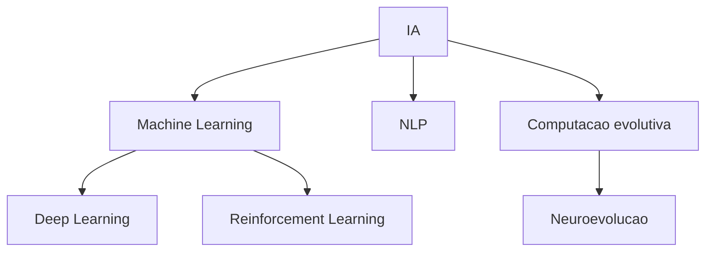

# Modulo IA 00: O que e IA, ML, DL, NLP e RL

Boa parte da confusao de quem esta estudando vem de nomes jogados sem mapa.

## 1. IA

IA, no sentido amplo, e a area que tenta construir sistemas capazes de executar tarefas que associamos a comportamento inteligente.

Isso inclui muito mais do que rede neural.

## 2. Machine Learning

Machine Learning e um subcampo da IA focado em sistemas que melhoram desempenho a partir de dados, experiencia ou interacao.

## 3. Deep Learning

Deep Learning e um subcampo do Machine Learning baseado em redes neurais com varias camadas e grande capacidade de representacao.

Nem toda rede neural e deep learning no sentido pratico popular.

## 4. NLP

NLP significa Natural Language Processing.

E a area de IA focada em linguagem humana:

- texto
- fala
- traducao
- resumo
- classificacao textual

Este projeto nao usa NLP.

## 5. Reinforcement Learning

RL e aprendizado por interacao entre agente e ambiente, mediado por recompensas.

Este projeto tem espirito parecido em alguns aspectos, mas tecnicamente ele nao usa RL classico. Ele usa neuroevolucao com algoritmo genetico.

## 6. Computacao evolutiva

Area que usa ideias inspiradas em evolucao biologica para otimizar solucoes.

Exemplo:

- algoritmo genetico
- estrategias evolutivas

## 7. Onde este projeto se encaixa

Este projeto e:

- IA
- machine learning em sentido amplo
- computacao evolutiva
- neuroevolucao

Nao e:

- NLP
- treinamento supervisionado
- RL classico com Q-learning ou policy gradient

## 8. Mapa mental correto

## Exercicios

### Exercicio 1

Explique por que este projeto nao deve ser chamado de NLP nem de aprendizado supervisionado.

### Exercicio 2

Escreva um paragrafo classificando tecnicamente este projeto usando pelo menos 4 termos corretos entre IA, ML, DL, NLP, RL e computacao evolutiva.
