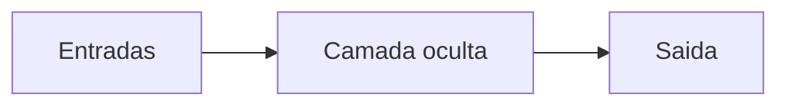

# Modulo NN 01: Fundamentos de rede neural

## 1. A definicao simples e correta

Uma rede neural artificial e um conjunto de transformacoes numericas parametrizadas que mapeia entradas em saidas.

Essa definicao e seca, mas muito precisa.

## 2. O que entra e o que sai no projeto

Entradas:

- 7 sensores de distancia
- 1 velocidade

Saidas:

- comando de virada
- comando de aceleracao

## 3. Neuronio artificial

Cada neuronio faz uma soma ponderada e uma ativacao:

$$
z = x_1w_1 + x_2w_2 + ... + x_nw_n + b
$$

$$
a = f(z)
$$

Traducao direta para codigo:

```python
z = x @ w + b
a = f(z)
```

## 4. Camadas

Uma rede simples pode ser vista assim:



No projeto:

$$
8 \rightarrow 14 \rightarrow 2
$$

Interpretacao:

- 8 entradas (7 sensores + 1 velocidade)
- 14 neuronios na camada oculta
- 2 saidas (virar e acelerar)

## 5. O que a rede aprende

Ela aprende combinacoes de pesos e bias que produzem boas acoes para os estados observados.

No projeto, isso ocorre por neuroevolucao (algoritmo genetico), nao por backpropagation classico.

## 6. O que a rede nao sabe sozinha

Ela nao sabe:

- o que e pista
- o que e bom ou ruim
- o que e reward

Ela depende do sistema em volta.

## 7. A intuicao mais importante

Rede neural e uma maquina de transformar sinais. O comportamento vem da composicao dessas transformacoes.

## 8. Ponte completa: da formula para NumPy

Vamos montar um forward de 1 camada escondida.

### 8.1 Shapes

- `x`: `(8,)`
- `W1`: `(8, 14)`
- `b1`: `(14,)`
- `W2`: `(14, 2)`
- `b2`: `(2,)`

### 8.2 Codigo

```python
import numpy as np


def sigmoid(z):
    z = np.clip(z, -60.0, 60.0)
    return 1.0 / (1.0 + np.exp(-z))


def forward(x, W1, b1, W2, b2):
    z1 = x @ W1 + b1
    a1 = np.tanh(z1)
    z2 = a1 @ W2 + b2
    a2 = sigmoid(z2)
    return a2


x = np.random.randn(8)
W1 = np.random.randn(8, 14)
b1 = np.zeros(14)
W2 = np.random.randn(14, 2)
b2 = np.zeros(2)

y = forward(x, W1, b1, W2, b2)
print(y.shape)  # (2,)
```

## 9. Versao em batch

Se `x` vira `(batch, 8)`, o forward inteiro vira em lote:

```python
x_batch = np.random.randn(32, 8)
z1 = x_batch @ W1 + b1      # (32, 14)
a1 = np.tanh(z1)
z2 = a1 @ W2 + b2           # (32, 2)
```

Esse e o coracao do processamento vetorizado.

## 10. Erros comuns ao implementar

- errar shape de `b1` e `b2`
- esquecer clip antes de `exp` e ter overflow
- misturar entrada de um carro com batch de varios carros
- nao separar claramente rede, simulacao e fitness

## 11. Como conectar com o restante do sistema

Rede so decide acao.

Quem transforma acao em resultado no mundo:

- fisica do carro
- colisao com pista
- calculo de fitness
- selecao/mutacao da proxima geracao

Por isso a rede e parte do sistema, nao o sistema inteiro.

## Exercicios

### Exercicio 1

Explique por que uma rede neural sem ambiente, entrada e criterio de sucesso nao faz nada util sozinha.

### Exercicio 2

Desenhe em papel uma rede `4 -> 3 -> 2` e rotule entradas, camada oculta e saidas.

### Exercicio 3

Implemente o forward mostrado e imprima todos os shapes intermediarios (`z1`, `a1`, `z2`, `a2`).
