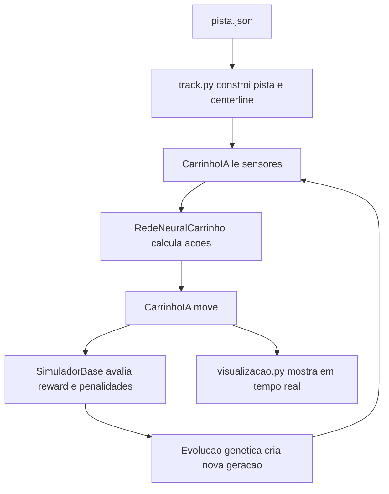

# Modulo IA Aplicacoes 00: Mapeando o projeto real

Este modulo existe para fazer a ponte final entre o conhecimento geral e o codigo concreto do repositorio.

## 1. As pecas do sistema

O sistema pode ser dividido em 6 blocos:

- pista
- sensores
- carro
- rede neural
- avaliacao de desempenho
- evolucao entre geracoes

## 2. Mapa do fluxo do projeto

## 3. O que estudar em cada arquivo

### `sim/track.py`

Estude para entender:

- representacao da pista
- centerline
- colisao
- sensores
- movimento do carro

### `sim/neural_network.py`

Estude para entender:

- arquitetura da rede
- pesos e bias
- forward pass
- mutacao
- crossover

### `sim/simulacao.py`

Estude para entender:

- como o fitness e montado
- quando um agente morre
- como os melhores sao escolhidos
- como a nova geracao e criada

### `sim/visualizacao.py`

Estude para entender:

- como o aprendizado foi tornado visivel
- como metricas ajudam a interpretar o comportamento

## 4. O que ha de mais valioso no design do projeto

- rede pequena e legivel
- geometria de pista separada da visualizacao
- uso de SDF para consulta rapida de pista
- fitness relativamente rico
- mecanismo de eliminacao de agentes improdutivos
- mutacao adaptativa com estagnacao

## 5. O que voce deve copiar quando fizer o seu

- separacao entre motor e interface
- configuracao em JSON
- medicao explicita de progresso
- representacao numerica clara do estado

## Exercicios

### Exercicio 1

Abra os 4 arquivos principais e escreva uma frase para o papel de cada um.

### Exercicio 2

Monte um fluxograma proprio do projeto sem olhar o diagrama acima, usando apenas o que voce conseguiu entender do codigo.
