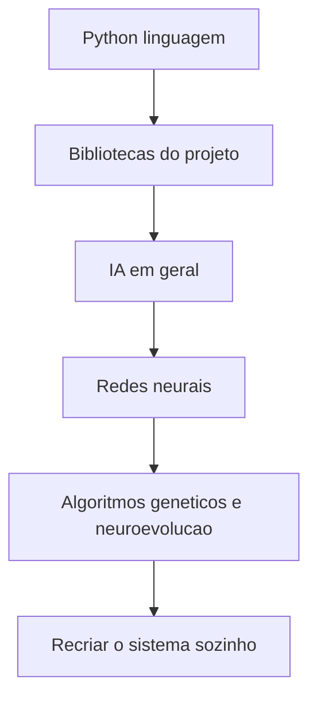

# Trilha de Estudo: Python, Bibliotecas, IA e Redes Neurais

Este material agora esta organizado em areas, como um mini-curso interno para te levar do entendimento do ecossistema Python ate a construcao de um sistema igual ou similar a este projeto.

Objetivo final:

- voce entender o Python que esta sendo usado
- voce dominar as bibliotecas principais do projeto
- voce entender IA, ML, NLP e redes neurais em contexto
- voce entender exatamente o que este projeto usa e o que ele nao usa
- voce conseguir projetar e implementar um sistema equivalente sozinho

## Estrutura principal

### Trilha 1: Python

- [python/README.md](./python/README.md)
- [python/language/00_mapa_python.md](./python/language/00_mapa_python.md)
- [python/language/01_sintaxe_e_idiomas.md](./python/language/01_sintaxe_e_idiomas.md)
- [python/language/02_classes_modulos_e_arquitetura.md](./python/language/02_classes_modulos_e_arquitetura.md)
- [python/language/03_arquivos_configuracao_e_debug.md](./python/language/03_arquivos_configuracao_e_debug.md)
- [python/language/04_ambientes_dependencias_e_execucao.md](./python/language/04_ambientes_dependencias_e_execucao.md)
- [python/language/05_testes_qualidade_e_evolucao_de_codigo.md](./python/language/05_testes_qualidade_e_evolucao_de_codigo.md)

### Trilha 2: Bibliotecas Python usadas aqui

- [python/libraries/README.md](./python/libraries/README.md)
- [python/libraries/00_standard_library_do_projeto.md](./python/libraries/00_standard_library_do_projeto.md)
- [python/libraries/01_numpy_profundo.md](./python/libraries/01_numpy_profundo.md)
- [python/libraries/02_matplotlib_para_simulacao.md](./python/libraries/02_matplotlib_para_simulacao.md)
- [python/libraries/03_tkinter_json_e_empacotamento.md](./python/libraries/03_tkinter_json_e_empacotamento.md)
- [python/libraries/04_serializacao_de_modelos_e_formatos.md](./python/libraries/04_serializacao_de_modelos_e_formatos.md)
- [python/libraries/05_pytorch_no_contexto_desta_trilha.md](./python/libraries/05_pytorch_no_contexto_desta_trilha.md)

### Trilha 3: IA em geral

- [AI/README.md](./AI/README.md)
- [AI/00_o_que_e_ia_ml_dl_nlp_rl.md](./AI/00_o_que_e_ia_ml_dl_nlp_rl.md)
- [AI/01_como_modelos_aprendem.md](./AI/01_como_modelos_aprendem.md)
- [AI/02_aplicacoes_e_limites.md](./AI/02_aplicacoes_e_limites.md)
- [AI/03_paradigmas_de_aprendizado.md](./AI/03_paradigmas_de_aprendizado.md)
- [AI/04_dados_features_loss_metricas.md](./AI/04_dados_features_loss_metricas.md)
- [AI/aplicacoes/00_mapeando_o_projeto_real.md](./AI/aplicacoes/00_mapeando_o_projeto_real.md)
- [AI/aplicacoes/01_sensores_fitness_e_reward_design.md](./AI/aplicacoes/01_sensores_fitness_e_reward_design.md)

### Trilha 4: Redes neurais e neuroevolucao

- [AI/NN/README.md](./AI/NN/README.md)
- [AI/NN/00_matematica_minima_para_redes.md](./AI/NN/00_matematica_minima_para_redes.md)
- [AI/NN/01_fundamentos_de_rede_neural.md](./AI/NN/01_fundamentos_de_rede_neural.md)
- [AI/NN/02_pesos_bias_forward_backprop.md](./AI/NN/02_pesos_bias_forward_backprop.md)
- [AI/NN/03_tipos_de_redes_neurais.md](./AI/NN/03_tipos_de_redes_neurais.md)
- [AI/NN/04_algoritmos_geneticos_e_neuroevolucao.md](./AI/NN/04_algoritmos_geneticos_e_neuroevolucao.md)
- [AI/NN/05_como_recriar_este_projeto.md](./AI/NN/05_como_recriar_este_projeto.md)
- [AI/NN/06_checklist_de_prontidao.md](./AI/NN/06_checklist_de_prontidao.md)
- [AI/NN/07_rede_neural_biologica_vs_artificial.md](./AI/NN/07_rede_neural_biologica_vs_artificial.md)
- [AI/NN/08_como_treinar_uma_rede_neural.md](./AI/NN/08_como_treinar_uma_rede_neural.md)
- [AI/NN/09_modelos_treinados_nao_treinados_e_transfer_learning.md](./AI/NN/09_modelos_treinados_nao_treinados_e_transfer_learning.md)
- [AI/NN/10_salvando_carregando_e_versionando_modelos.md](./AI/NN/10_salvando_carregando_e_versionando_modelos.md)

### Trilha 5: Exercicios e gabaritos

- [exercicios/README.md](./exercicios/README.md)
- [exercicios/01_python_e_arquitetura.md](./exercicios/01_python_e_arquitetura.md)
- [exercicios/02_numpy_e_matematica.md](./exercicios/02_numpy_e_matematica.md)
- [exercicios/03_ia_e_redes_neurais.md](./exercicios/03_ia_e_redes_neurais.md)
- [exercicios/04_algoritmos_geneticos_e_reward.md](./exercicios/04_algoritmos_geneticos_e_reward.md)
- [exercicios/05_projeto_integrador.md](./exercicios/05_projeto_integrador.md)
- [exercicios/gabaritos/README.md](./exercicios/gabaritos/README.md)

### Trilha 6: Projetos guiados

- [projetos/README.md](./projetos/README.md)
- [projetos/01_agente_em_corredor.md](./projetos/01_agente_em_corredor.md)
- [projetos/02_carro_com_rede_fixa.md](./projetos/02_carro_com_rede_fixa.md)
- [projetos/03_neuroevolucao_completa.md](./projetos/03_neuroevolucao_completa.md)

## Ordem recomendada

## Dica de estudo

Use o preview do Markdown no VS Code:

- `Ctrl+K V`
- `Ctrl+Shift+V`

Leia um modulo por vez e sempre resolva a lista curta de exercicios no final.

## Meta concreta

Quando terminar este material, a meta nao e apenas "entender o texto". A meta e conseguir responder sem cola:

- como Python esta sendo usado neste projeto
- por que NumPy e Matplotlib sao essenciais aqui
- o que e uma rede neural e o que sao pesos
- por que este projeto aprende sem backpropagation
- como voce implementaria sua propria pista, sensores, rede, fitness e evolucao

## Avaliacao honesta da cobertura

Depois desta revisao, a trilha nova cobre os blocos essenciais para voce conseguir recriar um projeto como este:

- linguagem Python aplicada ao dominio
- bibliotecas efetivamente usadas
- mapa conceitual de IA e do que este projeto usa ou nao usa
- matematica minima de vetores, matrizes, ativacao e geometria
- redes neurais, pesos, bias, forward e diferenca para backprop
- algoritmo genetico, fitness, reward design e neuroevolucao
- plano pratico de implementacao passo a passo

Depois desta expansao, ela tambem cobre:

- treino supervisionado e treino evolutivo em contraste
- diferenca entre rede biologica e rede artificial
- modelos treinados, nao treinados e transfer learning
- como salvar, carregar e versionar modelos
- ciclo de vida de experimento, dependencia e execucao em Python

O que ela nao faz sozinha e substituir horas de pratica. Ela te deixa tecnicamente equipado; a consolidacao vem implementando os exercicios e um prototipo proprio.

## Como transformar estudo em dominio

Sugestao de uso madura:

1. estude uma trilha teorica
2. resolva a lista correspondente em `exercicios/`
3. consulte o gabarito so depois de tentar de verdade
4. implemente um projeto progressivo em `projetos/`

Se voce fizer esse ciclo, a chance de realmente sair capaz de construir algo semelhante sobe muito.

## Desafios

### Desafio 1

Leia apenas os `README.md` das quatro trilhas e escreva uma frase dizendo o papel de cada trilha no seu aprendizado.

### Desafio 2

Crie um arquivo pessoal de notas e va registrando, a cada modulo, uma resposta curta para esta pergunta: "o que eu ja conseguiria construir agora que antes eu nao conseguia?"

